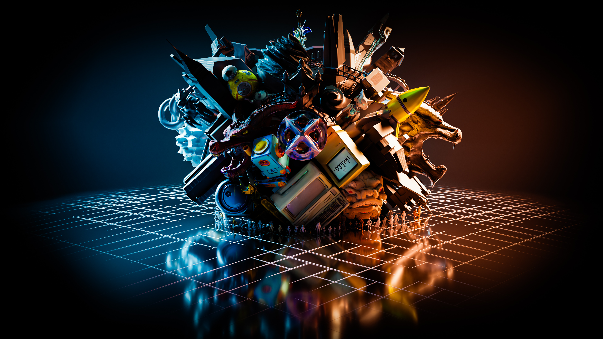
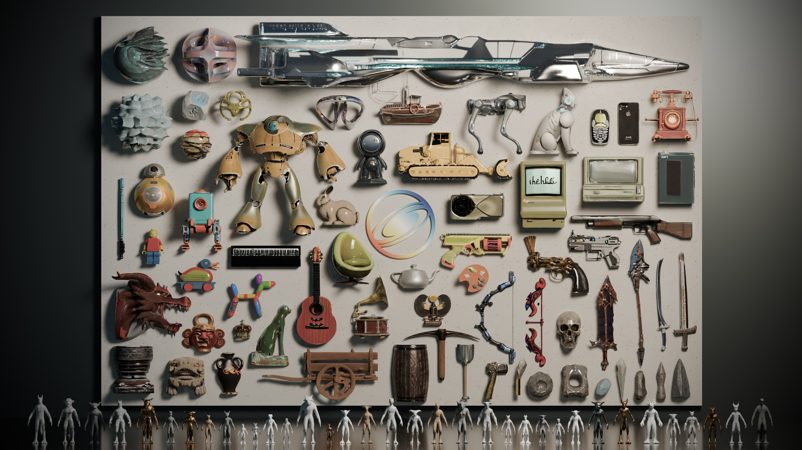

# CLAY: A Controllable Large-scale Generative Model for Creating High-quality 3D Assets

Against the backdrop of the great digital expanse, CLAY orchestrates a vibrant explosion of 3D creativity, marking the dawn of imagination unleashed.

Evolution of human innovation, from primitive tools and cultural artifacts to modern electronics and futuristic imaginings, generated by CLAY.

## 🚩 News

- [2024/04/09] Paper and code coming soon, stay tuned! Follow x.com/deemostech for the latest updates. 🔥🔥🔥
